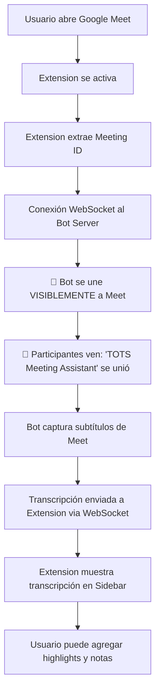

# 🤖 TOTS Meet Assistant - Bot Architecture

Una solución completa de asistente de reuniones para Google Meet con arquitectura basada en bot para transcripción confiable.

## 🏗️ Arquitectura del Sistema

### Componentes Principales

1. **🤖 Bot Backend** (`bot-backend/`)
   - Servidor Node.js con Puppeteer
   - Bot automatizado que se une a reuniones de Meet
   - Transcripción en tiempo real con OpenAI Whisper
   - WebSocket server para comunicación en tiempo real

2. **🧩 Chrome Extension** (`chrome-extension/`)
   - Manifest V3 extension
   - Sidebar integrada en Google Meet
   - Conexión WebSocket al bot backend
   - Captura de highlights y notas

3. **☁️ Cloud Deployment** (Render)
   - Hosting del bot backend
   - Escalamiento automático
   - SSL/WebSocket support

## 🚀 Flujo de Funcionamiento



## ⚠️ **Consideraciones Importantes**

### 🤖 **El Bot es un Participante Visible**
- **Aparece en la lista de participantes** como "🤖 TOTS Meeting Assistant"
- **Todos verán la notificación** de que el bot se unió a la reunión
- **No tiene cámara ni micrófono activos** (aparece silenciado)
- **Es completamente transparente** - no hay nada oculto

### 📋 **Política de Uso Recomendada**
1. **Informar a los participantes** antes de la reunión que se usará el asistente
2. **Solicitar consentimiento** para la transcripción automática  
3. **Cumplir con políticas** de privacidad de la empresa
4. **Usar solo en reuniones internas** de TOTS inicialmente

### 🔒 **Privacidad y Transparencia**
- ✅ Bot es completamente visible a todos
- ✅ No hay grabación de audio/video
- ✅ Solo procesa subtítulos de Google Meet
- ✅ Transcripción se guarda localmente en cada extensión
- ✅ Datos no se almacenan en servidores externos

## 📦 Instalación y Configuración

### 1. Configurar Bot Backend

```bash
cd bot-backend
npm install
```

Crear archivo `.env`:
```bash
OPENAI_API_KEY=sk-your-actual-key-here
NODE_ENV=development
PORT=3000
BOT_HEADLESS=false
```

### 2. Configurar Chrome Extension

1. Actualizar URLs en `chrome-extension/src/content.js`:
```javascript
const CONFIG = {
  BOT_SERVER_URL: 'https://your-bot-service.onrender.com',
  WS_SERVER_URL: 'wss://your-bot-service.onrender.com',
  // ...
};
```

2. Cargar extension en Chrome:
   - Ir a `chrome://extensions/`
   - Activar "Modo de desarrollador"
   - "Cargar extensión descomprimida"
   - Seleccionar carpeta `chrome-extension/`

### 3. Deploy a Render

Ver `bot-backend/DEPLOY.md` para instrucciones detalladas.

## 🎯 Características Principales

### Bot Automatizado
- ✅ Se une automáticamente a reuniones de Meet
- ✅ Transcripción en tiempo real con OpenAI Whisper
- ✅ Detección inteligente de cambios en subtítulos
- ✅ Manejo robusto de errores y reconexión

### Chrome Extension
- ✅ Sidebar elegante integrada en Meet
- ✅ Transcripción en tiempo real
- ✅ Sistema de highlights (notas, tareas, objetivos, preguntas)
- ✅ Atajos de teclado (Alt+1, Alt+2, Alt+3, Alt+4)
- ✅ Exportación de datos en JSON
- ✅ Estado visual de conexión con bot

### Servidor WebSocket
- ✅ Comunicación en tiempo real
- ✅ Manejo de múltiples reuniones simultáneas
- ✅ API REST para control del bot
- ✅ Health checks y monitoreo

## 🔧 API Endpoints

### REST API
- `GET /` - Status del servidor
- `GET /health` - Health check
- `POST /start-meeting` - Iniciar bot para reunión
- `POST /stop-meeting` - Detener bot

### WebSocket Events
- `join-meeting` - Extension se une a reunión
- `request-bot-start` - Solicitar inicio de bot
- `transcript-update` - Actualización de transcripción
- `bot-status` - Estado del bot
- `add-highlight` - Agregar highlight

## 💰 Costos Estimados

Para uso interno de TOTS:

- **Render Hosting**: $7/mes (Starter plan)
- **OpenAI Whisper API**: ~$0.006/minuto
- **Estimado total**: $30-50/mes para toda la empresa

## 🔍 Monitoreo y Debug

### Logs del Bot
```bash
# Ver logs en Render dashboard
# O localmente:
npm start
```

### Extension Debug
- Abrir DevTools en Google Meet
- Ver consola para logs de TOTS Assistant
- Verificar WebSocket connection status

### Health Checks
```bash
curl https://your-service.onrender.com/health
```

## 🛠️ Desarrollo Local

### Ejecutar Bot Backend
```bash
cd bot-backend
npm install
npm start
```

### Testear Extension
1. Cargar extension en Chrome (modo desarrollador)
2. Ir a Google Meet
3. Verificar que sidebar aparece
4. Verificar conexión a bot local en DevTools

### Estructura de Archivos

```
tots-meet-assistant/
├── bot-backend/
│   ├── server.js          # WebSocket server + API
│   ├── bot.js            # Puppeteer bot que se une a Meet
│   ├── transcription.js  # OpenAI Whisper integration
│   ├── package.json      # Dependencies
│   ├── .env.example      # Environment template
│   └── DEPLOY.md         # Deployment instructions
├── chrome-extension/
│   ├── manifest.json     # Extension configuration
│   └── src/
│       ├── content.js    # Main content script
│       ├── background.js # Service worker
│       └── popup.js      # Extension popup
└── README.md            # This file
```

## 🔐 Seguridad

- ✅ API key de OpenAI protegida en variables de entorno
- ✅ CORS configurado solo para dominios permitidos
- ✅ WebSocket con SSL/TLS en producción
- ✅ CSP compliance en Chrome extension
- ✅ Cleanup automático de archivos temporales

## 🤝 Contribuir

1. Fork el repositorio
2. Crear branch para feature: `git checkout -b feature/nueva-funcionalidad`
3. Commit cambios: `git commit -am 'Add nueva funcionalidad'`
4. Push al branch: `git push origin feature/nueva-funcionalidad`
5. Crear Pull Request

## 📄 Licencia

Proyecto interno de TOTS - Todos los derechos reservados.

## 🆘 Support

Para soporte técnico:
- Crear issue en el repositorio
- Contactar al equipo de desarrollo de TOTS
- Revisar logs en Render dashboard

---

**Made with ❤️ for TOTS Team**
